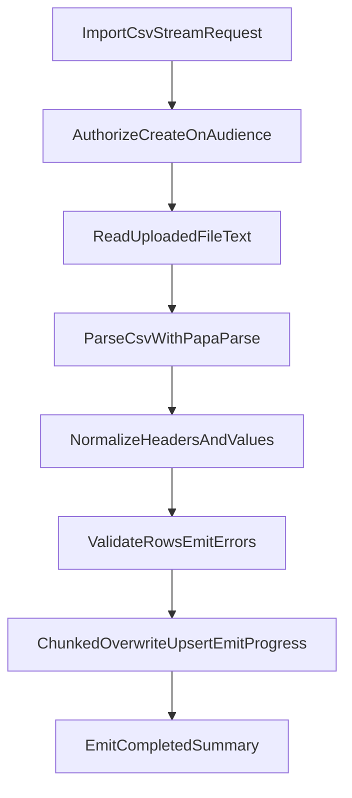

# CSV Contacts Import Handler Plan

## Goal

Implement a backend-only endpoint to import contacts from an uploaded CSV `File` into one audience, with real-time progress/error streaming and deterministic row-level reporting.

- No frontend changes.
- Duplicate strategy: overwrite existing contact values with CSV values.
- Authorization: only users allowed to create contacts in the audience can import.
- Stream status/errors during execution (v1 requirement).

## Technical Design

### 1) API Contract (File Upload + Streaming)

- Streaming handler input schema (only requested fields):
  - `audienceId: string`
  - `file: File`
- Stream output chunk schema (discriminated union):
  - `{ status: "starting"; totalRowsEstimate?: number }`
  - `{ status: "row_error"; rowNumber: number; code: string; message: string }`
  - `{ status: "in_progress"; processedRows: number; progress: number }`
  - `{ status: "completed"; summary: { totalRows: number; validRows: number; invalidRows: number; createdCount: number; updatedCount: number; skippedDuplicateInFileCount: number } }`
  - `{ status: "error"; message: string }`
- Guardrails:
  - accept only `text/csv` and compatible CSV MIME variants
  - `MAX_FILE_BYTES` validation against file size
  - `MAX_ROWS`
  - `MAX_ROW_ERRORS_EMITTED` to avoid unbounded event volume

### 2) Parsing + Normalization with `papaparse`

- Use `papaparse` for RFC4180 support (quoted fields, embedded commas/newlines, escaped quotes, BOM handling).
- Read CSV as `await file.text()` and parse with:
  - `header: true`
  - `skipEmptyLines: "greedy"`
  - `transformHeader` for canonicalization
  - `dynamicTyping: false` for deterministic typing
- Header normalization:
  - trim
  - lowercase
  - replace spaces/hyphens with underscore
  - map aliases to canonical keys: `firstName`, `lastName`, `email`, `phone`
- Unknown headers become `customAttributes` keys.
- Value normalization:
  - trim all text fields
  - empty string -> `undefined`
  - email -> lowercase
  - phone -> canonical normalized string (single normalization function)
  - custom attributes: preserve as strings in first iteration

### 3) Validation Rules

- Each row must provide at least one unique key after normalization: `email` or `phone`.
- Reject malformed email/phone with row-level error (`INVALID_EMAIL`, `INVALID_PHONE`).
- Reject fully empty rows (`EMPTY_ROW`).
- In-file duplicate resolution:
  - key = `email` if present else `phone`
  - first occurrence wins, later duplicates are skipped as `DUPLICATE_IN_FILE`
- Validation must be non-blocking: continue processing remaining rows.
- Emit `row_error` events as soon as a row is rejected (bounded by `MAX_ROW_ERRORS_EMITTED`).

### 4) Persistence Strategy (Overwrite Upsert)

- Process valid rows in chunks (e.g. `CHUNK_SIZE = 500`) to cap memory and query size.
- For each chunk:
  - batch fetch existing contacts in the audience by all chunk emails/phones (`OR` lookup)
  - build in-memory index for matches by normalized email/phone
  - for each row:
    - if match exists -> update that contact by overwriting mutable fields:
      - `firstName`, `lastName`, `email`, `phone`, `customAttributes`
    - else -> create new contact
- Conflict handling:
  - catch DB unique conflicts from race conditions
  - fallback: re-fetch + retry as update once
  - if second failure, report row as `PERSISTENCE_CONFLICT`
- Emit `in_progress` events after each chunk commit with deterministic percentage.

### 5) Error Mapping and API Behavior

- Authorization failure -> same external behavior as existing create path (no resource leakage).
- Internal exceptions -> `INTERNAL_SERVER_ERROR` with stable message.
- Row-level failures are streamed as `row_error` and do not abort request unless parser/global limits fail.
- Always emit terminal chunk: `completed` on success, `error` on fatal failure.

## Precise File Plan

- Add handler:
  - [/Users/baptistearno/.codex/worktrees/8ceb/typebot.io/packages/contacts/src/orpc/handleStreamImportContactsJob.ts](/Users/baptistearno/.codex/worktrees/8ceb/typebot.io/packages/contacts/src/orpc/handleStreamImportContactsJob.ts)
  - responsibilities: file input schema, async generator streaming chunks, API error mapping
- Extend domain service:
  - [/Users/baptistearno/.codex/worktrees/8ceb/typebot.io/packages/contacts/src/core/Contacts.ts](/Users/baptistearno/.codex/worktrees/8ceb/typebot.io/packages/contacts/src/core/Contacts.ts)
  - add `importFromCsv(...)` use case
- Extend repository contract and prisma implementation:
  - [/Users/baptistearno/.codex/worktrees/8ceb/typebot.io/packages/contacts/src/core/ContactsRepository.ts](/Users/baptistearno/.codex/worktrees/8ceb/typebot.io/packages/contacts/src/core/ContactsRepository.ts)
  - [/Users/baptistearno/.codex/worktrees/8ceb/typebot.io/packages/contacts/src/infrastructure/PrismaContactsRepository.ts](/Users/baptistearno/.codex/worktrees/8ceb/typebot.io/packages/contacts/src/infrastructure/PrismaContactsRepository.ts)
  - add bulk lookup + update/create helpers for chunk processing
- Register route:
  - [/Users/baptistearno/.codex/worktrees/8ceb/typebot.io/packages/contacts/src/orpc/router.ts](/Users/baptistearno/.codex/worktrees/8ceb/typebot.io/packages/contacts/src/orpc/router.ts)
- Add parser dependency:
  - [/Users/baptistearno/.codex/worktrees/8ceb/typebot.io/packages/contacts/package.json](/Users/baptistearno/.codex/worktrees/8ceb/typebot.io/packages/contacts/package.json)
  - add `papaparse`

## Acceptance Criteria

- Stream starts with `starting`, emits `in_progress` updates, then ends with `completed`.
- Invalid rows emit `row_error` events in near real-time while valid rows continue importing.
- Importing same CSV twice updates existing rows (overwrite semantics) without duplicate creation.
- Authorization and fatal internal failures emit terminal `error` event shape.
- Type checks pass for `@typebot.io/contacts`; then run repo-level `bun check`.
