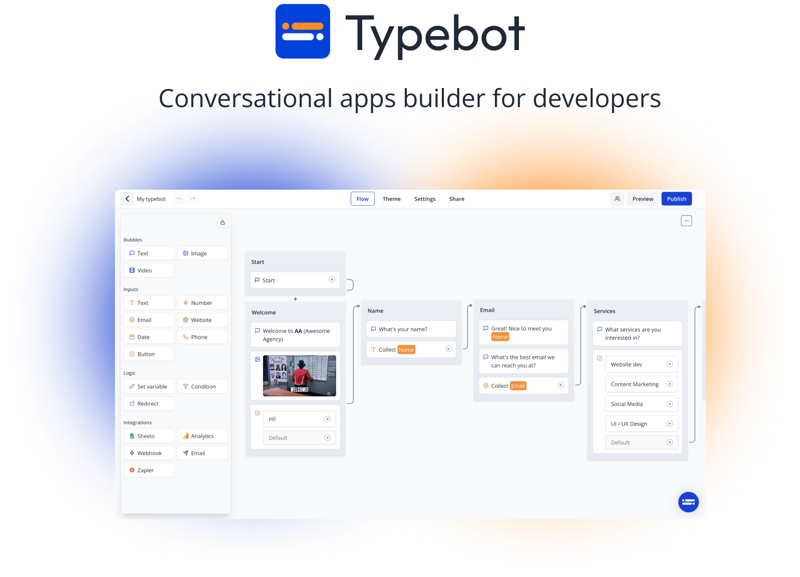
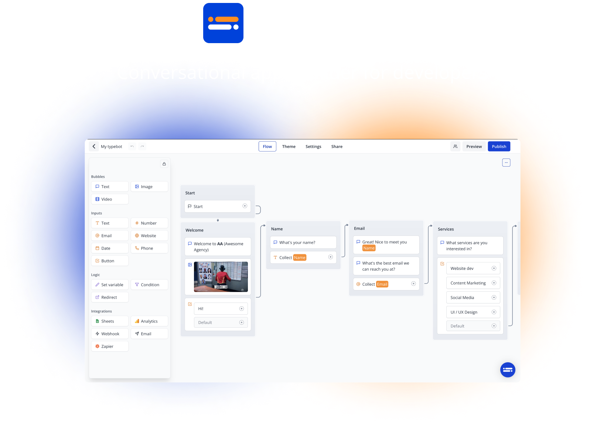
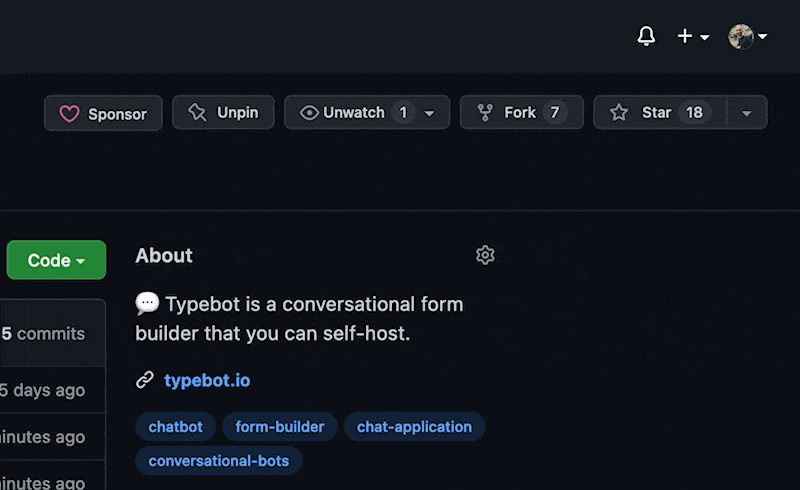

<p>
  <a href="https://typebot.io/#gh-light-mode-only" target="_blank">
    
  </a>
  <a href="https://typebot.io/#gh-dark-mode-only" target="_blank">
    
  </a>
</p>

https://user-images.githubusercontent.com/16015833/168876388-0310678d-080b-4eca-8633-e5cc4d7bd5d1.mp4

Typebot is an open-source alternative to Landbot. It allows you to create conversational apps/forms (Lead qualification, Product launch, User onboarding, Customer support), embed them anywhere on your web/mobile apps, and collect results in real-time.

## Features

- Text, image, video bubble messages
- Text, URL, email, phone number, date... input fields
- Native integrations including Google Sheets, Webhooks, Send email (more to come)
- Conditional branching, URL redirections
- Beautiful animations
- Theme is 100% customizable
- Embed as a container, popup, or chat bubble easily with the native JS library
- In-depth analytics

For more info, visit the [landing page](https://www.typebot.io)

## Stay up-to-date

Lots of new features are being implemented on a day-to-day basis. Make sure to hit the **Star** button and watch **Releases** to be notified of future features.



## Getting started with Typebot

The easiest way to get started with Typebot is with [the official managed service in the Cloud](https://app.typebot.io). You'll have high availability, backups, security, and maintenance all managed for you by me, Baptiste, Typebot's founder.

The cloud version can save a substantial amount of developer time and resources. For most sites this ends up being the best value option and the revenue goes to funding the maintenance and further development of Typebot.
So you’ll be supporting open source software and getting a great service!

## Self-hosting

Interested in self-hosting Typebot on your server? Take a look at the [self-hosting installation instructions](https://docs.typebot.io/self-hosting).

## Local setup

1. Clone the repo

   ```sh
   git clone https://github.com/baptisteArno/typebot.io.git
   ```

2. Install dependencies

   ```sh
   cd typebot.io
   pnpm i
   ```

3. Set up environment variables

   Copy `apps/builder/.env.local.example` to `apps/builder/.env.local`

   Copy `apps/viewer/.env.local.example` to `apps/viewer/.env.local`

   Copy `packages/prisma/.env.example` to `packages/prisma/.env`

   Check out the [Configuration guide](https://docs.typebot.io/self-hosting/configuration) if you want to enable more options

4. Make sure you have [Docker](https://docs.docker.com/compose/install/) running
5. Start the builder and viewer

   ```sh
   pnpm dev
   ```

   Builder is available at `http://localhost:3000`

   Viewer is available at `http://localhost:3001`

   Database inspector is available at `http://localhost:5555`

   By default, you can easily authenticate in the builder using the "Github Sign In" button. For other options, check out the [Configuration guide](https://docs.typebot.io/self-hosting/configuration)

6. (Optionnal) Start the landing page

   Copy `apps/landing-page/.env.local.example` to `apps/landing-page/.env.local`

   ```sh
   cd apps/landing-page
   pnpm dev
   ```

7. (Optionnal) Start the docs

   ```sh
   cd apps/docs
   pnpm start
   ```

## Contribute

Another great way to support Typebot is to contribute to the project. Head over to the [Contribute guidelines](https://github.com/baptisteArno/typebot.io/blob/main/CONTRIBUTING.md) to get started. 😍

## Technology

Typebot is a Monorepo powered by [Turborepo](https://turborepo.org/). It is composed of 2 main applications:

- the builder, where you build your typebots
- the viewer, where your user answer the typebot

These apps are built with awesome web technologies including [Typescript](https://www.typescriptlang.org/), [Next.js](https://nextjs.org/), [Prisma](https://www.prisma.io/), [Chakra UI](https://chakra-ui.com/), [Tailwind CSS](https://tailwindcss.com/).

## License

Typebot is open-source under the GNU Affero General Public License Version 3 (AGPLv3). You can find it [here](./LICENSE).

The goal of the AGPL license is to:

- Maximize user freedom and to encourage companies to contribute to open source.
- Prevent corporations from taking the code and using it as part of their closed-source proprietary products
- Prevent corporations from offering Typebot as a service without contributing to the open source project
- Prevent corporations from confusing people and making them think that the service they sell is in any shape or form approved by the original team

Here are the 3 different possible use cases:

<details>
  <summary>You'd like to self-host Typebot as-is without modifying the source code and you don't have the intention on commercializing your version of Typebot.</summary>

<p>

**You can host and use Typebot without restrictions. Your contributions to improve Typebot and fix bugs are welcome. 💙**

</p>

</details>

<details>
  <summary>You'd like to fork the project to build your own features on top of Typebot and you don't have the intention on commercializing your version of Typebot.</summary>
<p>

**You need to open-source your modifications**

</p>

</details>

<details>
  <summary>You'd like to commercialize your own version of Typebot</summary>

<p>

**You need to open-source your modifications and after your users registration, they should see a prominent mention and link to the original project (https://typebot.io). You should clearly mention that you provide a modified version. It's a good place to explain your version advantages comparing to the original project.**

</p>

</details>
