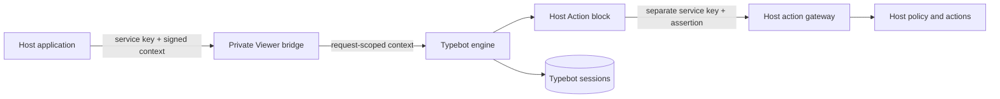

# Host Bridge

The Host Bridge lets a self-hosted application invoke a published Typebot flow while keeping identity, authorization, and business actions in the Host. Typebot owns flow authoring, published snapshots, execution, and sessions; the Host owns identity, policy, and action implementations.



## Endpoints

All endpoints are private service-to-service APIs. Deploy them on a private network or restrict ingress at the proxy; the URL path alone does not make them private.

- `POST /api/internal/host/flows/verify` accepts `{ "flowId": "..." }` and confirms that an available published flow exists. It returns no graph or session data.
- `POST /api/internal/host/flows/metadata` accepts `{ "flowId": "..." }` and returns minimal publication metadata and the related editable ID. This management response does not authorize execution.
- `POST /api/internal/host/start` accepts `{ "flowId": "...", "message": "optional" }`.
- `POST /api/internal/host/sessions/:sessionId/continue` accepts `{ "flowId": "...", "message": "..." }`.

Every request requires `x-host-service-key` and a signed `x-host-execution-context`. Continue also requires the opaque `x-host-session-binding` returned by start. The request flow ID, signed flow ID, persisted published-flow ID, and session binding are checked together. Start and continue use Typebot's existing handlers; this integration does not implement a second flow engine.

## Trusted context and secrets

The signed context is a versioned HMAC envelope:

```json
{
  "version": 1,
  "iss": "host-id",
  "aud": "botflow-host-action",
  "flowId": "published-flow-id",
  "executionId": "request-id",
  "iat": 0,
  "exp": 0,
  "claims": { "host-specific": "opaque-to-typebot" }
}
```

Typebot verifies the signature, issuer presence, audience, flow binding, and bounded validity period. Claims are opaque: Typebot does not interpret them as authorization. The verified envelope is carried only in server-side `AsyncLocalStorage` for the current request and is not copied into Flow JSON, variables, prefill, session state, results, or browser responses. Session bindings are HMAC-protected and bind the session, flow, and claims to prevent cross-session or cross-flow continuation. The short validity window does not make a signed request single-use; Hosts should use `executionId` for replay detection/idempotency when an Action has side effects.

Configure these server-side values with unique random secrets of at least 32 bytes:

- `HOST_BRIDGE_SERVICE_KEY`: Host-to-Viewer service authentication.
- `HOST_EXECUTION_CONTEXT_SIGNING_KEY`: verifies Host-signed execution context.
- `HOST_SESSION_BINDING_KEY`: signs continuation bindings; keep stable while sessions are active.
- `HOST_API_BASE_URL` and `HOST_SERVICE_AUTH_KEY`: Viewer-to-Host action gateway URL and separate service credential.

Never put these values in a Flow, Builder credential, browser configuration, or committed environment file. The checked-in examples contain placeholders only.

## Host Action block

The Forge block stores a stable `actionKey`, simple key/value inputs, and an optional output variable. At runtime it calls the configured Host gateway at `/internal/host/actions/:actionKey`, sending the signed assertion and a distinct service credential. It accepts only the controlled `{ "kind": "TEXT", "text": "..." }` response. Missing context, denial, timeout, malformed data, and transport errors fail closed. Public execution and Builder preview have no trusted context, so the Host Action is not executed there.

The Host must reload the actor and apply its current authorization policy for every action. Signed claims are not an authorization grant. The Host must allowlist action keys and validate inputs. Service credentials and user-specific data are never exposed through Builder metadata.

## Ownership and compatibility

Typebot owns draft/published graph data, execution traversal, and session state. A running session retains the snapshot used at start; later publication does not rewrite it. On completion, Typebot removes the active session and retains the Result. A Host may keep an opaque session reference for its own correlation, but should not duplicate graph or session state.

The Host integration is additive: standard Typebot flows and existing Forge handlers continue to work without Host context. Host-specific identity, permissions, action registries, and business rules remain outside Typebot.

## Verification

Targeted tests cover signed-context validation, request-scope isolation, flow/session binding, public fail-closed behavior, and the Host Action request/response contract. The published-flow regression requires a newly created disposable PostgreSQL database and is opt-in; it must never target a developer, staging, or production database.
